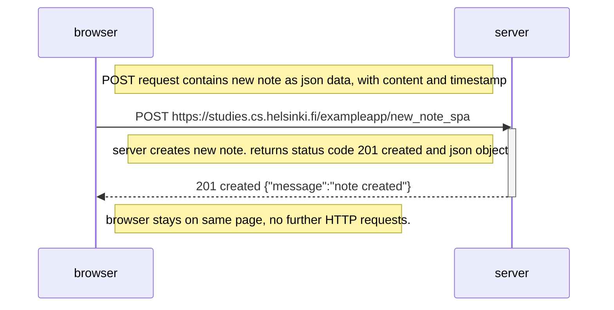

# exercise 0.6

```mermaid

sequenceDiagram
    participant browser
    participant server

    Note right of browser: POST request contains new note as json data, with content and timestamp
    browser->>server: POST https://studies.cs.helsinki.fi/exampleapp/new_note_spa
    activate server
    Note left of server: server creates new note. returns status code 201 created and json object
    server-->>browser: 201 created {"message":"note created"}
    deactivate server
    Note right of browser: browser stays on same page, no further HTTP requests.
    

```